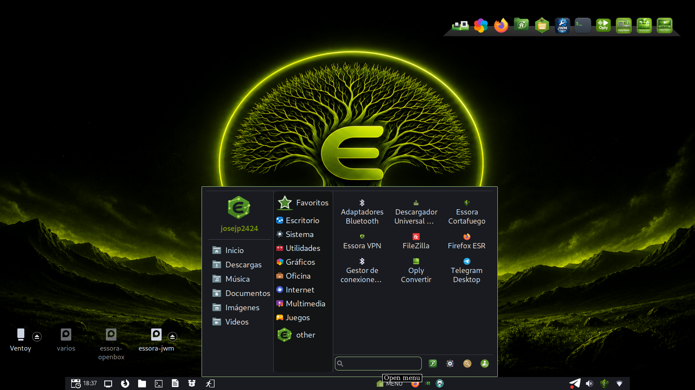

# Essora PyMenu

<p align="center">
  
</p>

<p align="center">
  A modern and lightweight application menu for Essora Desktop, written in C and GTK3.
</p>

---

## About

Essora PyMenu is a fork based on the original **PyMenuPup** project.

- **Original Python 3 version:** nilsonmorales
- **Original project:** [Woofshahenzup/PyMenuPup](https://github.com/Woofshahenzup/PyMenuPup)
- **C and GTK3 rewrite:** josejp2424

The original implementation was written in Python 3. The main application
menu has been rewritten in C and GTK3 by josejp2424 to reduce Python usage,
improve startup speed, lower memory consumption, and provide better
integration with lightweight desktop environments such as EssoraWM, JWM,
XLibre, and Puppy Linux.

The auxiliary configuration and menu-generation tools remain in Python
because they are only executed when the user changes settings or regenerates
the application menu. Opening the normal menu does not start Python.

---

## Features

### Native C and GTK3 menu

- Main application menu written in C
- Faster startup
- Reduced memory usage
- No Python interpreter required when opening the menu
- Progressive application and icon loading
- Icon caching
- Automatic closing when clicking outside the menu
- Escape key support
- Right-click application actions
- Desktop shortcut creation

### Desktop integration

- Full integration with Essora Desktop
- EssoraWM support
- JWM support
- Tint2 integration
- XLibre compatibility
- Puppy Linux compatibility
- User profile support
- Profile image management
- Favorites
- Application search
- Category filtering
- Multi-language support
- GTK theme support
- Dynamic icon loading
- Customizable layout
- Header customization
- System actions integration

### Application support

Applications and categories are loaded from:

```text
~/.config/essorawm/essora-menu.xml
```

The native menu supports every valid command stored in the XML, including:

- Regular desktop applications
- Flatpak applications
- AppImage applications
- Wine applications
- Essora system tools
- Custom user commands

The C program does not scan `.desktop` or `.directory` files every time it
opens. Application discovery and menu generation are handled separately by
`essora-menu-gen.py`.

---

## User configuration

Configuration is stored per user in:

```text
~/.config/essorawm/
```

Main generated files:

```text
~/.config/essorawm/pymenu.json
~/.config/essorawm/essora-menu.xml
```

Advantages:

- No `sudo` dependency inside the application
- Per-user configuration
- Multiple-user support
- Easy backup
- Independent desktop customization
- Existing configurations remain compatible with the native C version

---

## Menu generator

Essora PyMenu includes its own menu-generation system.

The generator reads:

```text
/etc/xdg/menus/essora-applications.menu
```

and creates:

```text
~/.config/essorawm/essora-menu.xml
```

Generator features:

- Automatic application detection
- XDG category parsing
- Dynamic icon detection
- Flatpak support
- AppImage support
- Wine support
- Custom categories
- User-generated menus
- Menu regeneration from the configuration interface

The generator remains in Python and runs only when the menu needs to be
created or refreshed.

---

## Essora integration

Essora PyMenu is adapted to work with:

- Essora Desktop
- EssoraWM
- EssoraFM
- Essora Store
- Essora system tools
- Essora profile manager
- Essora themes
- Essora menu-generation system
- JWM and Tint2
- Puppy Linux

---

## Visual customization

The following options can be configured:

- Window dimensions
- Header visibility
- Profile image shape
- Category icon size
- Application icon size
- Search position
- Colors
- Fonts
- Favorites
- Transparency
- GTK theme usage
- Category visibility
- Custom commands

---

## Repository layout

```text
essora-pymenu/
├── assets/
│   └── essorawm-pymenu.png
├── src/
│   ├── essora-pymenu.c
│   └── gtk3_abi.h
├── package/
│   ├── DEBIAN/
│   ├── etc/
│   └── usr/
├── build.sh
├── make-deb.sh
├── clean.sh
├── Makefile
├── README.md
├── CHANGELOG.md
├── LICENSE
├── VERSION
└── .gitignore
```

The `package/` directory contains the filesystem template used to create the
Debian package.

The installed application layout is:

```text
/usr/local/pymenu/
├── essora-pymenu
├── pymenu-config.py
├── pymenupuplang.py
├── ProfileManager.py
├── essora-menu-gen.py
├── generate_essora_directories.py
├── wine-desktop-creator.py
├── locale/
├── defaults/
└── icon-pymenu/
```

The compatible launcher is installed at:

```text
/usr/local/bin/pymenu
```

---

## Components retained in Python

The following tools remain in Python because they are not required during
normal menu startup:

- `essora-menu-gen.py`
- `generate_essora_directories.py`
- `pymenu-config.py`
- `ProfileManager.py`
- `pymenupuplang.py`
- `wine-desktop-creator.py`

The main menu itself is implemented in C and GTK3.

---

## Build dependencies

Recommended packages for Debian and Devuan:

```sh
apt install build-essential pkg-config libgtk-3-dev
```

For lightweight Puppy Linux systems, the repository also includes
`src/gtk3_abi.h`.

When the GTK3 development headers are unavailable, `build.sh` attempts to
compile directly against the GTK3 libraries installed on the system.

---

## Compile and prepare the Debian package

Clone the repository:

```sh
git clone https://github.com/YOUR-USERNAME/essora-pymenu.git
cd essora-pymenu
```

Compile the program and create the Debian package directory:

```sh
./build.sh
```

The resulting directory will be similar to:

```text
build/essora-pymenu_1.0.1-1_amd64/
```

It will contain:

```text
DEBIAN/
etc/
usr/
```

This directory is ready to be packaged manually:

```sh
dpkg-deb --build --root-owner-group \
    build/essora-pymenu_1.0.1-1_amd64
```

To compile and create the `.deb` package in one step:

```sh
./make-deb.sh
```

You can also use `make`:

```sh
make
make deb
make clean
```

Commands:

- `make` compiles and prepares the Debian package directory
- `make deb` creates the `.deb` package
- `make clean` removes generated build files

Compiled binaries, the `build/` directory, and `.deb` packages are excluded
from Git through `.gitignore`.

---

## Installation

After creating the package:

```sh
dpkg -i essora-pymenu_1.0.1-1_amd64.deb
```

The main binary is installed at:

```text
/usr/local/pymenu/essora-pymenu
```

and can be launched with:

```sh
pymenu
```

---

## Closing the menu by clicking outside

While the menu is visible, it temporarily grabs pointer clicks. This allows
the menu to close when the user clicks outside its window, including under
JWM and XLibre, where clicking the desktop does not always generate a normal
focus-out event.

For debugging, automatic closing can be disabled with:

```sh
ESSORA_PYMENU_NO_AUTO_CLOSE=1 pymenu
```

---

## Credits

Essora PyMenu is based on PyMenuPup.

### Original implementation

- **Author:** nilsonmorales
- **Language:** Python 3
- **Project:** [Woofshahenzup/PyMenuPup](https://github.com/Woofshahenzup/PyMenuPup)

### Essora adaptation and native rewrite

- **Author:** josejp2424
- **Main menu language:** C
- **GUI toolkit:** GTK3

Main changes include:

- Native C and GTK3 application menu
- Essora Desktop integration
- EssoraWM integration
- Per-user configuration system
- Removal of the Python dependency during normal menu startup
- Removal of the internal `sudo` dependency
- Essora visual adaptation
- Integrated menu generator
- Flatpak, AppImage, and Wine support
- Dynamic menu generation
- Improved desktop integration
- Click-outside automatic closing
- Debian package build system

---

## License

This project preserves the original upstream license and credits while adding
the modifications and native C rewrite developed for the Essora ecosystem.

GNU General Public License v3.0 or later.

